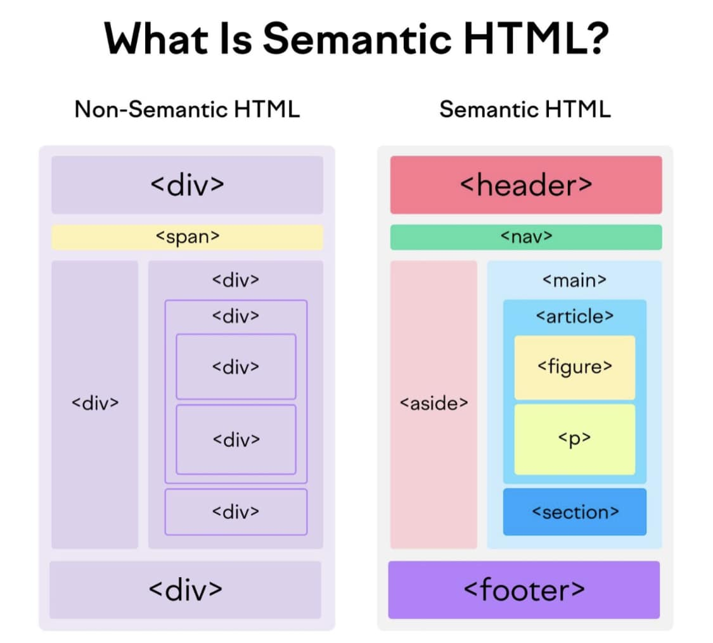

# SEMANTIC HTML LÀ GÌ? 

## TẠI SAO NÓ LẠI QUAN TRỌNG VỚI CẤU TRÚC WEBSITE?

Ngoài Semantic keywords thì Semantic HTML cũng là một trong những yếu tố onpage giúp cho thuật toán của search engine hiểu các thành phần nào là quan trọng trong một trang web. 

Semantic HTML là cách viết HTML mà sử dụng các thẻ HTML ứng với nội dung được chứa trong nó chứ không phải sử dụng các thẻ theo cách mà chúng ta muốn nội dung trong đó được hiển thị. Nếu bạn là một Front-end web developer thì nên quan tâm đến Semantic HTML.

Semantic HTML rất quan trọng vì các công cụ tìm kiếm sử dụng thuật toán để xếp hạng các trang và Semantic HTML giúp đảm bảo rằng các tín hiệu được gửi đến công cụ tìm kiếm là chính xác và hữu ích nhất có thể.

Về cốt lõi,  Semantic HTML chỉ đơn giản là một cách mô tả cấu trúc và nội dung của một trang web thông qua các thẻ HTML. Semantic HTML có thể được thực hiện bằng cách sử dụng các thẻ HTML như thẻ tiêu đề, danh sách và đoạn văn, thay vì làm cho văn bản trông đẹp hơn với các kỹ thuật HTML nâng cao hơn. 

Sử dụng thẻ HTML đúng cách cho phép các công cụ tìm kiếm hiểu rõ hơn về nội dung trang web của bạn, giúp search engine dễ dàng phân loại và xếp hạng nó hơn. Từ đó giúp người dùng dễ dàng tìm thấy nội dung họ đang tìm kiếm. 

Việc sử dụng các thẻ HTML đảm bảo rằng nội dung được cấu trúc hợp lý (nếu nội dung phù hợp với trải nghiệm người dùng, bạn sẽ cải thiện được time onsite và giảm tỉ lệ thoát trang).

Điều này có thể dẫn đến trải nghiệm người dùng tốt hơn, đó là một yếu tố quan trọng trong SEO. Điều này có thể dẫn đến thứ hạng được cải thiện, vì khả năng tiếp cận ngày càng trở nên quan trọng đối với các thuật toán của công cụ tìm kiếm. 

Bằng cách sử dụng thẻ HTML đúng cách, bạn có thể đảm bảo rằng nội dung trang web của bạn được cấu trúc tốt và được hiểu bởi các thuật toán của công cụ tìm kiếm.

