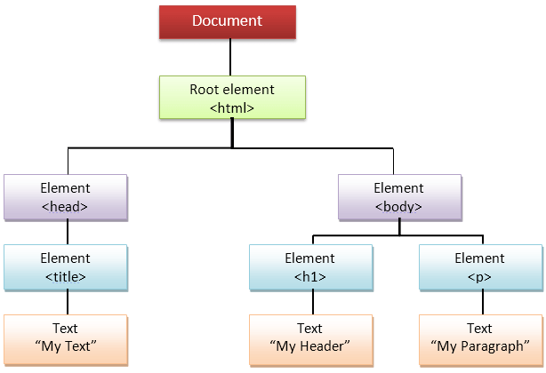

# How does a Browser render a Webpage?

Quá trình làm việc của trình duyệt web khi nhận mã nguồn HTML được chia thành các bước cụ thể

## 1. Gửi yêu cầu (Client Request)
- Khi người dùng nhập một địa chỉ URL vào thanh địa chỉ của trình duyệt và nhấn Enter, trình duyệt sẽ tạo một yêu cầu HTTP đến máy chủ tương ứng để lấy trang web.
- Yêu cầu này chứa thông tin như loại yêu cầu (GET, POST, etc.), địa chỉ URL, và các thông tin khác như header của yêu cầu.

## 2. Nhận và Phân tích yêu cầu (Server Processing)
- Máy chủ nhận yêu cầu và xử lý nó bằng cách tìm kiếm tài nguyên được yêu cầu, thực hiện các tác vụ như xác thực, kiểm tra quyền truy cập, và xử lý các yêu cầu.

## 3. Trả lời (Response)
- Máy chủ sẽ tạo một phản hồi HTTP chứa mã nguồn HTML, CSS, JavaScript, và các tài nguyên khác cần thiết để hiển thị trang web.

## 4. Bắt đầu tải về (Start Downloading)

- Trình duyệt nhận được phản hồi từ máy chủ và bắt đầu quá trình tải về tài nguyên.
- Các tài nguyên như HTML, CSS, JavaScript, hình ảnh sẽ được tải về một cách tuần tự hoặc song song tùy thuộc vào quy định của trình duyệt.

## 5. Phân tích HTML (HTML Parsing)
- Trình duyệt bắt đầu phân tích mã nguồn HTML khi nó được tải về.
- Quá trình này bao gồm việc xây dựng một cây DOM `(Document Object Model)` để biểu diễn cấu trúc của trang web.

### 5.1. Phân tích HTML (HTML Parsing)

- Trình duyệt bắt đầu quá trình phân tích mã nguồn HTML khi nó được tải về từ máy chủ.
- Trong quá trình này, trình duyệt đọc từng ký tự trong mã nguồn và chuyển đổi nó thành các phần tử (elements) và các nút (nodes) trong cây DOM.
- Mỗi thẻ HTML, ví dụ như *div*, *p*, *a*, được chuyển đổi thành một phần tử trong cây DOM. Nó cũng bao gồm các thuộc tính của thẻ như class, id, src, href, v.v.

### 5.2 Xây dựng Cây DOM (DOM Tree Construction)
> Document Object Model is a high-level Web API provided by the browser to efficiently render a webpage & **expose it publically for the developers to dynamically manipulate DOM elements for various purposes.**

- Khi trình duyệt đọc tài liệu HTML, bất cứ khi nào nó gặp một phần tử HTML, nó sẽ tạo ra một đối tượng JS gọi là Node. Cuối cùng, tất cả các phần tử html sẽ được chuyển đổi thành tệp Node.
- Sau khi trình duyệt đã tạo các nút từ tài liệu HTML, nó phải tạo cấu trúc "giống cây" của các đối tượng nút này.
- Cây DOM là một biểu diễn cây có cấu trúc của trang web, trong đó mỗi nút đại diện cho một phần tử, thuộc tính hoặc văn bản trên trang.

### 5.3 Gắn Cây DOM vào Trình Duyệt
- Sau khi cây DOM được xây dựng, nó được gắn vào trình duyệt để có thể sử dụng cho việc hiển thị và tương tác với trang web.
- Cây DOM sẽ được sử dụng để tạo ra cấu trúc của trang và quyết định vị trí của mỗi phần tử trên trang.

### 5.4 CSSOM Construction (Xây dựng CSS Object Model):
- Ngoài việc xây dựng cây DOM, trình duyệt cũng xây dựng CSS Object Model (CSSOM) từ các tệp CSS được liên kết với trang.
- CSSOM là một biểu diễn của các quy tắc CSS áp dụng cho trang.

### 5.5 Render Tree Construction (Xây dựng Render Tree)
- `Cây DOM` và `CSSOM` được kết hợp để tạo ra Render Tree, là một cây mô hình hóa cách trang web sẽ được hiển thị trên màn hình.
- Chỉ các phần tử cần thiết để hiển thị trang được thêm vào Render Tree.

### 5.6 Hiển thị (Rendering)
- Khi Render Tree được xây dựng, trình duyệt sẽ bắt đầu quá trình hiển thị trang web, đặt các phần tử vào đúng vị trí trên màn hình dựa trên thông tin từ Render Tree.

## 6. Tải các tài nguyên khác (Resource Loading)
- Trong quá trình phân tích HTML, trình duyệt sẽ gặp các thẻ như *link*, *script*, và *img* chứa các đường dẫn tới các tài nguyên khác.
- Các tài nguyên này sẽ được tải về và xử lý tương tự như HTML.

## 7. Hiển thị (Rendering)
- Khi tất cả các tài nguyên được tải về, trình duyệt bắt đầu quá trình hiển thị trang web.
- Các phần tử của trang web được vị trí hóa dựa trên thông tin từ cây DOM và các kiểu CSS áp dụng.

## 8. Thực hiện JavaScript (JavaScript Execution)
- Nếu có mã JavaScript trong trang, trình duyệt sẽ thực hiện nó.
- JavaScript có thể thay đổi nội dung và cấu trúc của trang, tương tác với người dùng và thực hiện các tác vụ khác.

## 9. Hoàn thành (Page Load Complete)
- Khi tất cả các tài nguyên đã được tải về và trang web đã được hiển thị đầy đủ, trình duyệt sẽ kích hoạt sự kiện load, cho biết rằng trang đã được tải xong.

## References

- Render-tree Construction, Layout, and Paint: 
    - <https://dev.to/anuradha9712/how-does-a-browser-render-a-webpage-2en8>
    - <https://web.dev/articles/critical-rendering-path/render-tree-construction>
    - <https://gist.github.com/nishantmendiratta/db09531f80803465da36f0d43c3e58ac>
- Khả năng tương thích của các tính năng và API web trên các trình duyệt khác nhau: 
    - <https://caniuse.com/>